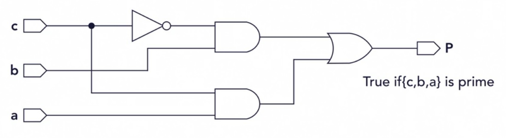

# Only Prime Numbers

**Question:**

Design a circuit which its output is one **[true]** only when the binary numbers of its inputs are prime numbers. In other words, “p” is **true** whenever the inputs are 2, 3, 5, and 7, and it is **false** for 0, 1, 4, and 6.\
Consider “c” as the most significant bit, and “a” as the least significant bit. 

---------------------------------------------------------------------------------------

**Solution:**

Three implementations have been provided:
\
1-	Gate implementation (prime_gate.v)
\
2-	Boolean implementation (prime_boolean.v)
\
3-	Procedural implementation (prime_procedural.v)

Furthermore, the test bench (prime_TB.v) has been provided to check the validity of all modules.
\
(Do not forget to comment/uncomment the lines 28-30 for testing each module).

